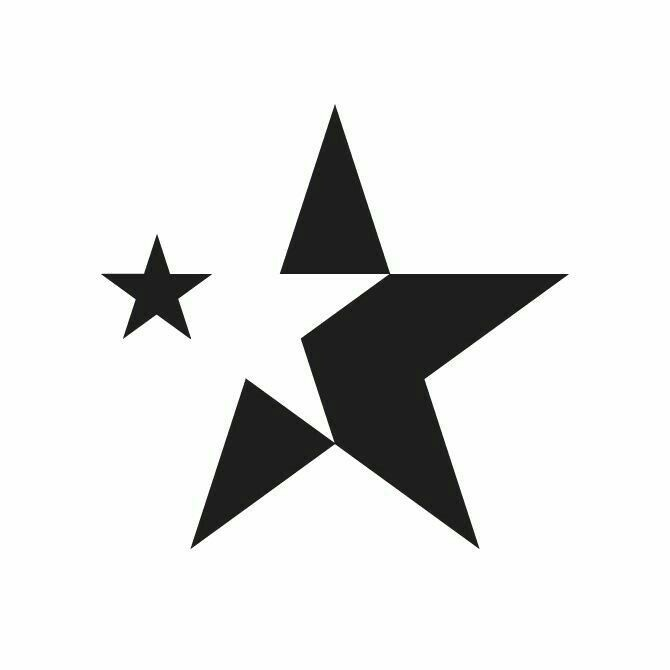

> Логотип проекта

  

------------------------------------------------------------------------------------

<h2 align="center">Localization</h2>
<table align="center">
    <tbody>
        <tr>
            <td>
            </td>
            <td>
            </td>
 	    <td>
            </td>
        </tr>
    </tbody>
</table>  

------------------------------------------------------------------------------------

# DARK-DRIFT

**DARK-DRIFT** - это последний проект `Darkside-Interactive` в многопользовательской игре `San Andreas Multiplayer` до ухода в отставку.

# Репозиторий

Этот репозиторий содержит: 
  - исходный код основного игрового мода на языке скриптинга <a href="https://ru.wikipedia.org/wiki/Pawn">Pawn</a>;
  - колонтитульные файлы:
    - инклуды;
    - фильтрскрипты;
    - скриптфайлы;
  - плагины;
  - исходный код плагина `Map Andreas`;

# Директории файлов

   - <h3><a href="https://github.com/Darkside-Interactive/DARK-DRIFT/tree/develop/gamemodes/GodEater.pwn">gamemodes/GodEater.pwn</a> - основной игровой мод; </h3>
   - <h3><a href="https://github.com/Darkside-Interactive/DARK-DRIFT/tree/develop/filterscripts/">filterscripts</a> - все филььтрскрипты, которые подгружаются в <a href="https://github.com/Darkside-Interactive/DARK-DRIFT/tree/develop/server.cfg">server.cfg</a>; </h3>
   - <h3><a href="https://github.com/Darkside-Interactive/DARK-DRIFT/tree/develop/plugins/">plugins</a> - игровые плагины; </h3>
   - <h3><a href="https://github.com/Darkside-Interactive/DARK-DRIFT/tree/develop/scriptfiles/">scriptfiles</a> - скриптфайлы, в которых находятся настройки сервера и аккаунты.; </h3>

# Использование проекта

Все ресурсы находятся под лицензией `SAMP-LICENSE` и являются собственностью `Darkside Interactive`. Использование исходного кода в целях личной выгоды, кражи, передачи третьим лицам или для распространения в массы строго запрещено.  
 Все логотипы в`../sources/images/` являются торговыми марками соответствующих компаний и действуют в соответствии с их условиями и лицензиями.
